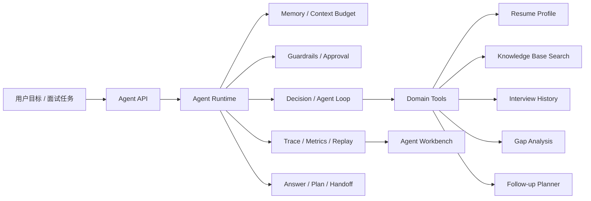

<div align="center">

<h1>Interview Agent</h1>

面向求职与技术面试场景的 Java Agent 工作台：把简历、知识库、面试记录、工具调用、记忆与可观测执行链路组织成一个可运行、可调试、可评估的 Agent 项目。

[](https://openjdk.org/)
[](https://spring.io/projects/spring-boot)
[](https://spring.io/projects/spring-ai)
[](https://react.dev/)
[](https://www.typescriptlang.org/)
[](https://www.postgresql.org/)
[](#核心能力)
[](./LICENSE)

<p>
  <a href="#项目定位">项目定位</a> ·
  <a href="#核心能力">核心能力</a> ·
  <a href="#agent-架构">Agent 架构</a> ·
  <a href="#技术栈">技术栈</a> ·
  <a href="#快速开始">快速开始</a> ·
  <a href="#路线图">路线图</a>
</p>

</div>

---

## 项目定位

Interview Agent 是一个围绕面试准备场景构建的 Agent 工程项目，重点放在运行时、领域工具、记忆、Trace、Guardrails 和评测闭环。

它把原本分散的能力沉淀为可被 Agent 调度的领域工具：

- 简历画像：解析候选人经历、提取技能证据、识别风险点与改进空间。
- 知识检索：基于 PostgreSQL + pgvector 的 RAG 检索，为回答、讲解和追问提供依据。
- 面试上下文：读取历史面试表现、回答质量、薄弱项和追问链路。
- 执行运行时：维护 Agent 会话、turn、memory、trace、guardrail、approval 和 terminal state。
- 调试与评估：提供 Workbench、Trace Explorer 和固定评测集，支撑回放、排障和能力量化。

项目当前仍保留简历管理、模拟面试、知识库问答等完整业务入口，但这些入口已经不是最终目的，而是 Agent 工具层和验证场景的一部分。

## 核心能力

| 能力域 | 当前状态 | Agent 化目标 |
| --- | --- | --- |
| Agent Runtime | 已具备 session、turn、message、step trace、terminal state | 支撑稳定的多步规划、工具调用、失败恢复和结果交付 |
| Tool Calling | 已封装简历画像、知识库检索、面试历史、差距分析、追问建议等领域工具 | 让 Agent 基于业务证据自主选择工具与下一步动作 |
| Memory / Context | 已有会话消息、上下文组装、预算控制和 memory snapshot | 让历史表现、用户目标和检索证据真正参与推理 |
| Guardrails / Approval | 已有风险等级、拦截动作、运行时审批和安全降级 | 控制敏感输出、危险操作和不完整上下文下的行为 |
| Trace / Eval | 已有阶段评测集、回归样本、trace 记录和 benchmark 文档 | 让 Agent 能被解释、复现、量化和持续改进 |
| Workbench UI | 已有 Agent 工作台、执行叙事、trace explorer、审批队列 | 作为开发、调试、演示和回放的统一入口 |

## 功能入口

### Agent 工作台

- 创建 Agent 会话并提交求职/面试目标。
- 观察每个 turn 的输入、决策、工具输出、状态变化和终止原因。
- 查看工具调用结果、风险处理、审批队列和执行叙事。
- 通过固定场景验证成功路径、降级路径和失败恢复路径。

### 简历画像

- 支持 PDF、DOCX、DOC、TXT 等格式的简历上传与解析。
- 基于 LLM 生成结构化简历分析结果。
- 使用 Redis Stream 异步处理分析任务，避免长耗时请求阻塞前端。
- 支持分析报告导出，为 Agent 提供候选人画像依据。

### 知识库与 RAG

- 支持上传 PDF、DOCX、Markdown 等知识文档。
- 自动分块、向量化并写入 PostgreSQL + pgvector。
- 提供 SSE 流式问答能力。
- 作为 Agent 的知识检索工具，为追问、讲解和复盘提供证据。

### 面试与复盘

- 根据简历生成个性化面试题。
- 支持多轮追问、回答记录、分批评估和报告生成。
- 面试历史可被 Agent 读取，用于识别薄弱项、规划训练路线和生成后续建议。

## Agent 架构



核心链路：

1. 用户提交面试准备、简历分析或复盘目标。
2. Agent Runtime 创建会话与 turn，组装 memory、历史消息和领域上下文。
3. Guardrails 判断当前输入、工具调用和输出风险。
4. Agent 根据目标选择领域工具，例如简历画像、知识库检索、面试历史总结、差距分析或追问建议。
5. Runtime 记录每一步 trace、tool output、terminal state 和指标。
6. 前端 Workbench 展示完整执行过程，评测脚本使用固定样本做回归与能力量化。

## 当前异步任务流程

简历分析、知识库向量化和面试报告生成仍使用 Redis Stream 处理：

```text
上传请求 -> 保存文件 -> 发送消息到 Stream -> 立即返回
                              |
                              v
                      Consumer 消费消息
                              |
                              v
                    执行分析 / 向量化 / 生成任务
                              |
                              v
                      更新数据库状态
                              |
                              v
                   前端轮询或刷新获取最新状态
```

状态流转：`PENDING` -> `PROCESSING` -> `COMPLETED` / `FAILED`。

## 技术栈

### 后端

| 技术 | 版本 | 用途 |
| --- | --- | --- |
| Java | 21 | 后端开发语言 |
| Spring Boot | 4.0 | Web、配置、JPA、Actuator |
| Spring AI | 2.0 | LLM、Embedding、Vector Store 集成 |
| PostgreSQL + pgvector | 14+ | 业务数据、会话数据、向量检索 |
| Redis / Redis Stream | 6+ | 缓存、异步任务、状态流转 |
| Apache Tika | 2.9.2 | PDF、Word、文本解析 |
| iText 8 | 8.0.5 | PDF 报告导出 |
| MapStruct | 1.6.3 | DTO / Entity 映射 |
| Gradle | 8.14 | 构建与测试 |

### 前端

| 技术 | 版本 | 用途 |
| --- | --- | --- |
| React | 18.3 | UI 框架 |
| TypeScript | 5.6 | 类型系统 |
| Vite | 5.4 | 开发与构建 |
| Tailwind CSS | 4.1 | 样式 |
| React Router | 7.11 | 路由 |
| Framer Motion | 12.23 | 动效 |
| Recharts | 3.6 | 图表 |
| Lucide React | 0.468 | 图标 |

## 项目结构

```text
interview-agent/
├── app/                         # Spring Boot 后端
│   ├── src/main/java/interview/guide/
│   │   ├── App.java             # 启动类
│   │   ├── common/              # 通用配置、异常、异步、响应封装
│   │   ├── infrastructure/      # 文件、存储、Redis、PDF、Mapper
│   │   └── modules/
│   │       ├── agent/           # Agent runtime、tool、memory、trace、guardrail
│   │       ├── interview/       # 面试会话、题目、回答、评估、报告
│   │       ├── knowledgebase/   # 知识库上传、解析、向量化、RAG
│   │       └── resume/          # 简历上传、解析、分析、历史
│   └── src/main/resources/
│       ├── application.yml      # 应用配置
│       └── prompts/             # LLM 提示词模板
├── frontend/                    # React 前端
│   ├── src/api/                 # API 调用
│   ├── src/components/          # 公共组件与 Agent 工作台组件
│   ├── src/pages/               # 页面
│   ├── src/types/               # 类型定义
│   └── tests/                   # 前端测试
├── docs/                        # Agent 设计、阶段任务、评测与证据文档
├── scripts/                     # 本地基础设施与评测脚本
├── docker/                      # Docker 初始化脚本
├── docker-compose.yml
└── README.md
```

## 快速开始

### 环境要求

| 依赖 | 版本 | 必需 |
| --- | --- | --- |
| JDK | 21+ | 是 |
| Node.js | 18+ | 是 |
| pnpm | 10+ | 推荐 |
| PostgreSQL | 14+ | 是 |
| pgvector | - | 是 |
| Redis | 6+ | 是 |
| S3 兼容存储 | MinIO / RustFS | 是 |

### 1. 克隆项目

```bash
git clone https://github.com/Kiyra-gjx/interview-guide.git interview-agent
cd interview-agent
```

### 2. 配置数据库

```sql
CREATE DATABASE interview_agent;
CREATE EXTENSION IF NOT EXISTS vector;
```

### 3. 配置环境变量

```bash
export AI_BAILIAN_API_KEY=your_api_key
```

常用可选配置：

```bash
export AI_MODEL=qwen-plus
export POSTGRES_DB=interview_agent
export APP_STORAGE_BUCKET=interview-agent
```

### 4. 启动后端

按需修改 `app/src/main/resources/application.yml` 中的数据库、Redis、对象存储和 CORS 配置，然后执行：

```bash
./gradlew bootRun
```

默认后端端口：`http://localhost:18080`。

### 5. 启动前端

```bash
cd frontend
pnpm install
pnpm dev
```

默认前端端口：`http://localhost:5173`。

## Docker 快速部署

项目提供了 `docker-compose.yml`，可启动前端、后端、PostgreSQL、Redis 和 MinIO。

```bash
cp .env.example .env
# 编辑 .env，填入 AI_BAILIAN_API_KEY
docker-compose up -d --build
```

服务地址：

| 服务 | 地址 | 默认账号 | 默认密码 |
| --- | --- | --- | --- |
| 前端 | http://localhost | - | - |
| 后端 API | http://localhost:18080 | - | - |
| MinIO 控制台 | http://localhost:9001 | `minioadmin` | `minioadmin` |
| MinIO API | `localhost:9000` | - | - |
| PostgreSQL | `localhost:5432` | `postgres` | `password` |
| Redis | `localhost:6379` | - | - |

常用命令：

```bash
docker-compose ps
docker-compose logs -f app
docker-compose down
docker image prune -f
```

## 本地基础设施脚本

WSL2 + Docker Desktop 环境可以使用脚本启动基础设施：

```bash
./scripts/infra-wsl.sh up
./scripts/infra-wsl.sh env
./scripts/infra-wsl.sh check
./scripts/infra-wsl.sh down
```

默认 stack 名称为 `agent-dev`，默认数据库为 `interview_agent`，默认对象存储桶为 `interview-agent`。

## 测试与评测

后端测试：

```bash
./gradlew test
```

Agent 阶段评测：

```bash
./gradlew agentStage2Eval
./gradlew agentStage2SafetyEval
./gradlew agentStage3ContextEval
./gradlew agentStage3MemoryEval
./gradlew agentStage5Benchmark
./gradlew agentStage5RecoveryEval
```

前端测试：

```bash
cd frontend
pnpm test:run
```

## 文档索引

| 文档 | 内容 |
| --- | --- |
| `docs/agent-overview.md` | Agent 项目总览 |
| `docs/agent-capability-map.md` | 能力地图 |
| `docs/agent-roadmap.md` | 阶段路线图 |
| `docs/current-code-architecture.md` | 当前代码架构 |
| `docs/agent-demo-flow.md` | 工作台场景流说明 |
| `docs/agent-stages/stage-7-rag-trust-tool-routing-and-injection-safety.md` | Stage 7：RAG 可信性、注入安全与工具路由评测 |
| `docs/agent-evals/README.md` | Agent Eval 文档索引 |
| `docs/evidence/agent-quantification/README.md` | Agent 能力量化证据 |

## 路线图

- [x] Agent session / turn / trace 基础模型
- [x] Guardrails、风险等级、运行时审批
- [x] 简历、知识库、面试历史等领域工具
- [x] Context assembly、memory snapshot、预算控制
- [x] Agent Workbench、Trace Explorer、执行叙事
- [x] 固定评测集、benchmark 和回归报告
- [ ] RAG 检索可信性与 chunk 来源证据
- [ ] 外部内容注入安全评测
- [ ] 工具路由与参数契约评测
- [ ] 更完整的多步 Agent loop 策略
- [ ] 更细粒度的 tool result normalization 与错误恢复
- [ ] 面试训练计划、知识补全和复盘建议的闭环
- [ ] 生产化观测指标、权限模型和部署边界

## 上游来源与许可证

本仓库基于 AGPL-3.0 项目二次开发，保留并重构了部分面试平台业务能力，同时新增 Agent runtime、tooling、guardrail、trace、eval 和 workbench 等模块。

- 当前仓库：<https://github.com/Kiyra-gjx/interview-guide>
- 上游项目：<https://github.com/Snailclimb/interview-guide>

许可证继续遵循 AGPL-3.0。通过网络提供服务时，需要向用户公开修改后的源码。
