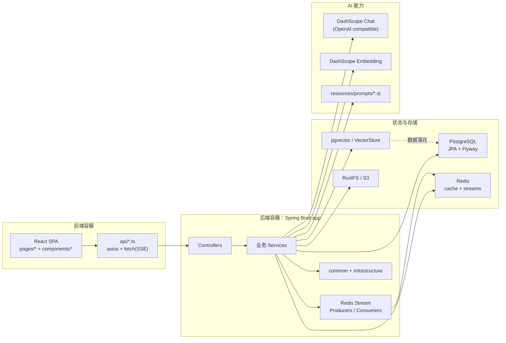
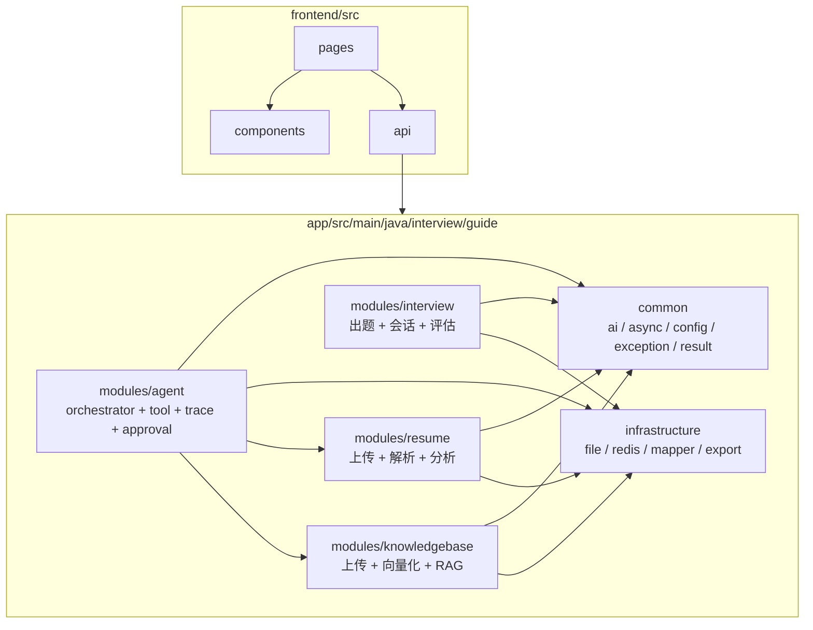
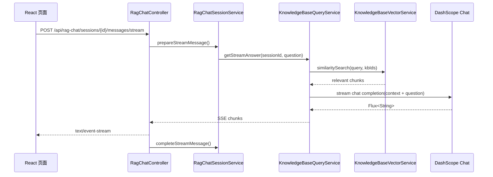
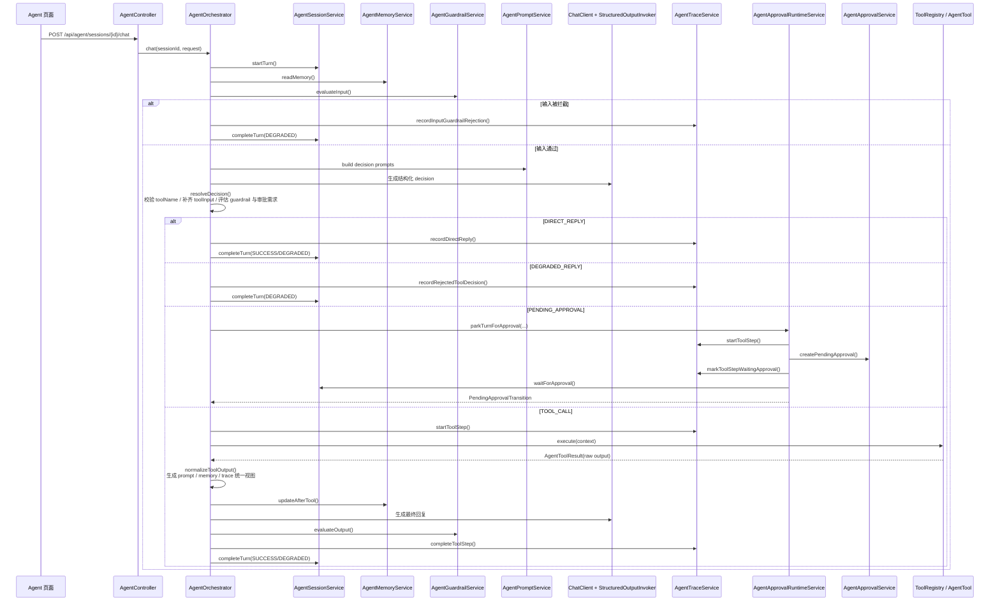
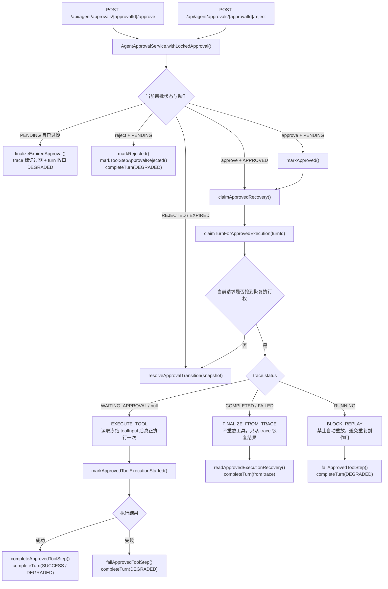

# 当前代码架构图与设计细节

> 更新时间：2026-04-25
>
> 图形工具：Mermaid
>
> 适用范围：当前仓库中的 React 前端、Spring Boot 后端、Redis Stream 异步链路、RAG 与 Agent 子系统。

## 为什么这里选 Mermaid

- 直接写在 Markdown 里，最适合和代码一起维护。
- GitHub 与大多数文档平台都能直接渲染，不需要额外托管外链 SVG。
- 文本 diff 友好，后续模块变更时容易一起 review。
- 如果以后要做汇报图，再从 Mermaid 导出 SVG/PNG 即可。

当前仓库更适合“文档即源码”的方式，而不是先画一张静态图片再手工同步。

## 1. 系统容器视图

### 结论

- 当前不是微服务拆分，而是一个单体后端承载多个业务子域。
- 前端与后端是两个独立工程，但运行时是一个前台 SPA 对接一个后端应用。
- 状态并不是只放在一个地方，而是按职责拆分到 PostgreSQL、Redis、pgvector 和 S3。

## 2. 代码模块边界

### 结论

- 代码组织的主轴是“垂直业务切片 + 横向基础设施”。
- `common` 和 `infrastructure` 提供通用能力，真正的业务流程主要在 `modules/*`。
- `agent` 模块没有独立出服务边界，而是站在现有 `resume` 与 `knowledgebase` 能力之上做编排。

## 3. 三条异步业务链路

```mermaid
flowchart TB
    subgraph ResumeFlow["简历上传与分析（异步）"]
        R1["ResumeController"]
        R2["ResumeUploadService"]
        R3["ResumePersistenceService<br/>ResumeEntity.analyzeStatus=PENDING"]
        R4["AnalyzeStreamProducer"]
        R5["Redis Stream"]
        R6["AnalyzeStreamConsumer"]
        R7["ResumeGradingService"]
        R8["保存分析结果<br/>analyzeStatus -> COMPLETED / FAILED"]
        R1 --> R2 --> R3 --> R4 --> R5 --> R6 --> R7 --> R8
    end

    subgraph KBFlow["知识库上传与向量化（异步）"]
        K1["KnowledgeBaseController"]
        K2["KnowledgeBaseUploadService"]
        K3["KnowledgeBasePersistenceService<br/>vectorStatus=PENDING"]
        K4["VectorizeStreamProducer"]
        K5["Redis Stream"]
        K6["VectorizeStreamConsumer"]
        K7["KnowledgeBaseVectorService"]
        K8["TokenTextSplitter + VectorStore<br/>按 kb_id 写入 pgvector"]
        K1 --> K2 --> K3 --> K4 --> K5 --> K6 --> K7 --> K8
    end

    subgraph InterviewFlow["面试完成后的评估（异步）"]
        I1["InterviewController"]
        I2["InterviewSessionService"]
        I3["InterviewSessionCache<br/>Redis 24h TTL"]
        I4["InterviewPersistenceService"]
        I5["EvaluateStreamProducer"]
        I6["Redis Stream"]
        I7["EvaluateStreamConsumer"]
        I8["AnswerEvaluationService"]
        I1 --> I2
        I2 --> I3
        I2 --> I4
        I2 --> I5 --> I6 --> I7 --> I8 --> I4
    end
```

### 这些异步链路的共同设计

- 都先写业务状态，再把任务投递到 Redis Stream。
- 前端拿到的是 `PENDING` 状态，而不是阻塞等待 AI 结果。
- Producer / Consumer 都复用了 `common/async` 下的模板基类。
- 失败状态不是只打日志，而是会回写到业务表，前端可以直接感知。

## 4. RAG 对话链路

### 这条链路的关键点

- RAG 问答本身是同步查询，但返回形式是 SSE 流式输出。
- 会话消息先落库，再开始流式返回，所以历史记录可以保留完整对话。
- `KnowledgeBaseQueryService` 不只是简单相似度检索，还做了 query rewrite、动态 topK/minScore 和命中有效性校验。
- SSE 在前端没有走统一 axios，而是直接走 `fetch`。

## 5. Agent 编排链路

### 这条链路的关键点

- `resolveDecision()` 不是直接信任模型提案，它会继续做工具名校验、参数补齐、缺参检查、Tool guardrail 与审批需求解析。
- 审批发生在真正的 `tool.execute()` 之前；待审批分支只冻结 trace、toolInput 和 latestUserMessage，不会先执行工具。
- `agent` 模块不是普通聊天接口，而是有持久化执行状态的编排器。
- 核心对象不是只有 message，还有 `session`、`turn`、`step trace`、`memory`、`approval`。
- `turn` 有租约与终态控制，避免同一个会话被并发执行污染。
- Tool 原始结果先产出 `summary / answerPayload / debugPayload / confirmedFacts`，再由 `AgentToolResult` 统一投影成 Prompt 的回答视图、Memory 的写回视图，以及 Trace / API 的 `toolOutput` 视图。
- Tool 调用前后都落 trace，Agent 前端可以读取 trace/memory/approval，并直接消费统一的 `toolOutput` 做可观测界面。
- 当前已注册的 Tool 主要是只读型能力：读取简历画像、检索知识库。

### 审批恢复链路

### 批准后的三种恢复语义

- `EXECUTE_TOOL`：trace 还停在 `WAITING_APPROVAL`，说明工具尚未真正开始执行；批准后可以用冻结的 `toolInput` 与 `latestUserMessage` 安全执行一次。
- `FINALIZE_FROM_TRACE`：trace 已经是 `COMPLETED` 或 `FAILED`，说明工具结果或失败已经落盘；这时不重放工具，只把 turn 按 trace 恢复到最终结果。
- `BLOCK_REPLAY`：trace 还是 `RUNNING`，说明之前可能已经开始执行，但当前请求无法确认副作用是否发生；为避免重复执行，系统会阻止自动重放并降级收口。
- `resolveApprovalTransition(...)` 只处理“当前请求没有拿到继续执行 claim”的情况：要么审批已经在本次调用里直接终结，要么当前请求只能返回当前快照，不能继续推进工具执行。

## 6. 具体设计细节

### 6.1 总体架构判断

- 当前架构更接近“单体 + 垂直切片 + 事件化后处理”，不是严格的六边形架构，也不是微服务。
- AI 能力没有散落在 Controller，而是集中在具体领域 Service 中。
- Prompt 资源被放进 `app/src/main/resources/prompts`，避免把长 Prompt 直接硬编码到业务逻辑里。

### 6.2 前端设计

| 区域 | 当前做法 | 关键文件 |
| --- | --- | --- |
| 页面组织 | BrowserRouter + lazy load，按简历、面试、知识库、Agent 四条主线拆页 | `frontend/src/App.tsx` |
| 普通请求 | axios 统一处理后端 `Result<T>` 包装 | `frontend/src/api/request.ts` |
| 流式请求 | SSE 直接用 `fetch` 读取流，不经过 axios | `frontend/src/api/knowledgebase.ts`、`frontend/src/api/ragChat.ts` |
| Agent UI 数据面 | 除了聊天响应，还会读 trace / memory / approvals；其中 trace 已暴露统一 `toolOutput` 视图与归一化标记 | `frontend/src/api/agent.ts`、`frontend/src/types/agent.ts` |

### 6.3 后端业务切片

| 模块 | 主要职责 | 同步/异步特征 | 关键入口 |
| --- | --- | --- | --- |
| `modules/resume` | 上传简历、解析文本、去重、异步分析、导出 PDF | 上传同步，分析异步 | `ResumeController`、`ResumeUploadService`、`AnalyzeStreamProducer`、`AnalyzeStreamConsumer`、`ResumeGradingService` |
| `modules/interview` | 生成问题、管理作答进度、恢复会话、异步评估报告 | 会话同步，评估异步 | `InterviewController`、`InterviewSessionService`、`InterviewQuestionService`、`EvaluateStreamProducer`、`EvaluateStreamConsumer`、`AnswerEvaluationService` |
| `modules/knowledgebase` | 上传文档、解析、向量化、RAG 检索、RAG 会话 | 上传异步向量化，查询同步/SSE | `KnowledgeBaseController`、`KnowledgeBaseUploadService`、`KnowledgeBaseVectorService`、`KnowledgeBaseQueryService`、`RagChatController`、`RagChatSessionService` |
| `modules/agent` | Agent session、turn 生命周期、decision、tool、memory、trace、approval、guardrail | 请求驱动，同步编排，支持审批恢复 | `AgentController`、`AgentOrchestrator`、`AgentSessionService`、`AgentTraceService`、`AgentApprovalService`、`AgentGuardrailService` |

### 6.4 共享基础设施

| 能力 | 当前做法 | 关键文件 |
| --- | --- | --- |
| 结构化 AI 输出 | 统一 strict JSON、重试、轻量修复 | `app/src/main/java/interview/guide/common/ai/StructuredOutputInvoker.java` |
| Redis Stream 模板 | Producer / Consumer 生命周期、ACK、重试统一封装 | `app/src/main/java/interview/guide/common/async/AbstractStreamProducer.java`、`app/src/main/java/interview/guide/common/async/AbstractStreamConsumer.java` |
| 文件存储 | 简历与知识库原始文件统一进入 RustFS/S3 | `app/src/main/java/interview/guide/infrastructure/file/FileStorageService.java` |
| Redis 能力 | 缓存、锁、Stream 操作统一封装 | `app/src/main/java/interview/guide/infrastructure/redis/RedisService.java` |
| 面试过程态缓存 | 面试会话缓存到 Redis，支持从数据库恢复 | `app/src/main/java/interview/guide/infrastructure/redis/InterviewSessionCache.java` |
| Prompt 管理 | `.st` 模板文件资源化 | `app/src/main/resources/prompts/*` |

### 6.5 数据与状态分工

| 介质 | 存储内容 | 当前用途 |
| --- | --- | --- |
| PostgreSQL | 业务实体、分析结果、面试会话、RAG 会话、Agent 会话/消息/turn/trace/approval | 主业务状态与恢复基础 |
| pgvector | 知识库 chunk 向量 | RAG 相似度检索 |
| Redis Key/Value | 面试会话缓存、未完成面试映射、锁 | 快速读取与短期过程态 |
| Redis Stream | 简历分析、知识库向量化、面试评估 | 异步任务队列 |
| RustFS / S3 | 原始简历与知识库文件 | 文件对象存储 |

### 6.6 Agent 子系统的数据库演进

- `app/src/main/resources/db/migration/V1__agent_base_schema.sql`：`agent_sessions`、`agent_messages`、`agent_step_traces`
- `app/src/main/resources/db/migration/V2__agent_turn_foundation.sql`：增加 `agent_turns`，把一次对话执行从消息流里抽成显式生命周期对象
- `app/src/main/resources/db/migration/V3__agent_observability_foundation.sql`：补 trace 可观测性字段
- `app/src/main/resources/db/migration/V4__agent_guardrails_baseline.sql`：补 guardrail 相关字段
- `app/src/main/resources/db/migration/V5__agent_runtime_approval_policy.sql`：增加 `agent_approvals`

这说明 `agent` 模块已经从“聊天消息扩展”演进成“可恢复执行状态机”。

### 6.7 当前最重要的架构特征

1. 文件类业务都遵循“原文件进 S3，对象元数据与状态进数据库”的双存储模式。
2. AI 密集型长耗时步骤基本都被拆到 Redis Stream，避免接口长时间阻塞。
3. 面试模块是“Redis 过程态 + PostgreSQL 恢复态”的混合模型。
4. 知识库模块把“上传向量化”和“检索问答”拆成两条链路，分别优化。
5. Agent 模块是当前最复杂的子系统，已经具备 guardrail、approval、trace、memory、turn lease，以及统一的 tool output normalization。

## 7. 阅读源码时的推荐入口

如果要从代码继续往下看，建议按下面顺序读：

1. `frontend/src/App.tsx`
2. `frontend/src/api/request.ts`
3. `app/src/main/java/interview/guide/modules/resume/service/ResumeUploadService.java`
4. `app/src/main/java/interview/guide/modules/interview/service/InterviewSessionService.java`
5. `app/src/main/java/interview/guide/modules/knowledgebase/service/KnowledgeBaseQueryService.java`
6. `app/src/main/java/interview/guide/modules/agent/service/AgentOrchestrator.java`
7. `app/src/main/java/interview/guide/common/ai/StructuredOutputInvoker.java`
8. `app/src/main/resources/db/migration/V1__agent_base_schema.sql` 到 `V5__agent_runtime_approval_policy.sql`

## 8. 后续维护建议

- 新增业务模块时，先更新“系统容器视图”和“代码模块边界”。
- 新增 Redis Stream 任务时，补到“异步业务链路”。
- 新增 Agent Tool、审批策略或 guardrail 时，补到 “Agent 编排链路”。
- 如果架构开始拆服务，再把当前文档升级为“系统上下文图 + 服务级部署图”。
